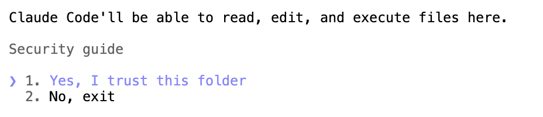
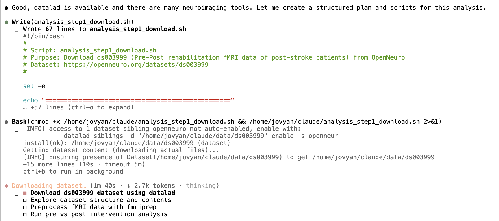

start `claude` on a terminal and authenticate with an Anthropic subscription. 

Note: claude outputs a long URL on the terminal and the jupyterhub terminal unfortunatley adds linebreaks in the URL which render it invalid. To fix this, copy the authentication URL into an editor and manually remove the linebreaks before pasting it into a browser.

accept that you trust the folder:

Then give it a task and approve the permission requests while it works away:
