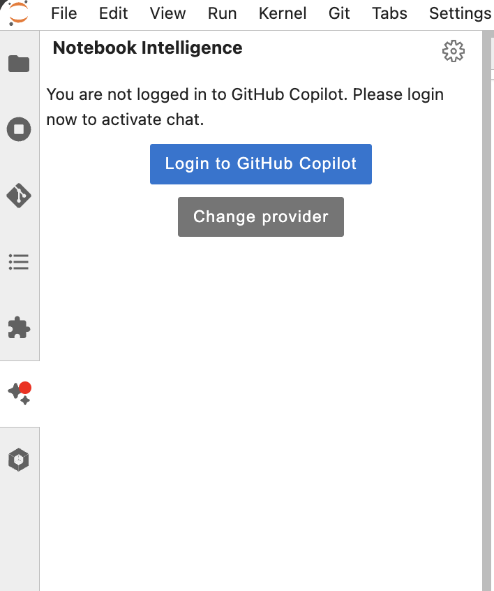
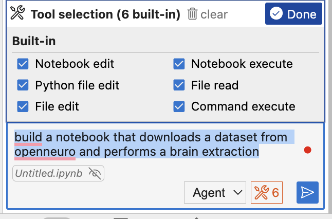
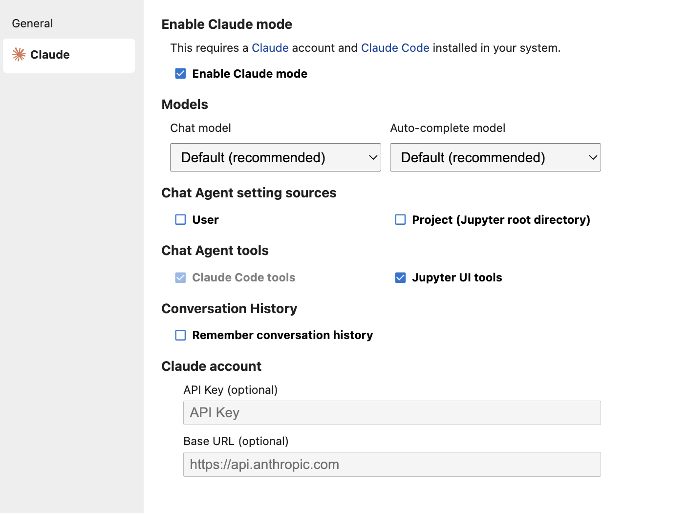

Start Notebook Intelligence from the side panel:

Then connect Github Copilot (or Change the model provider)

Switch to agent, select all tools (via the settings button next to the Agent Selector) and give it a task:

You can also ask it to fill in code in specific cells:

For a more capable model you can also switch to Claude in the settings:
